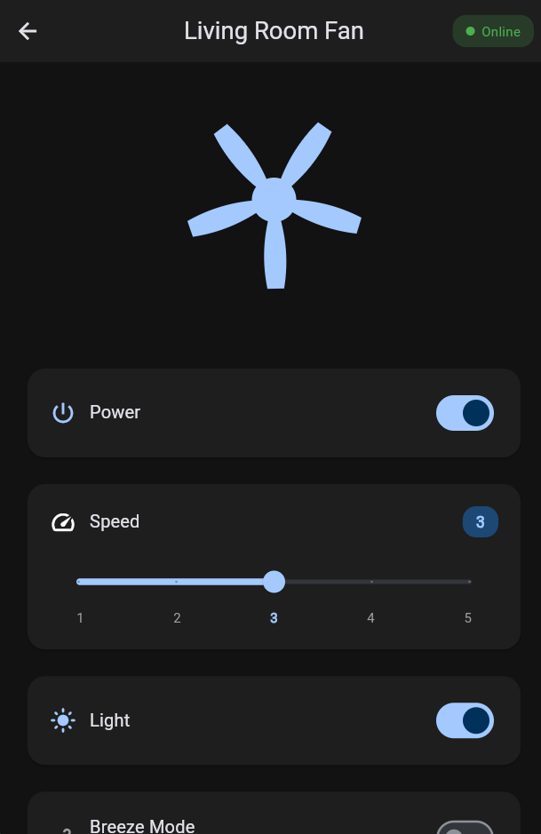

<div align="center">

# 🌀 Atomberg Smart Fan Controller

A **beautiful and responsive Flutter app** for controlling Atomberg smart fans 🏠🌀
Built for **quick demos and real-world usage** with smooth animations 🎞️, clean UI ✨, and intuitive controls 🎛️.


</div>

---

## ✨ Highlights

* Elegant dashboard with animated fan cards 🧩 and status chips
* One-tap controls: power ⚡, speed 🎚️, breeze 🌬️, and light 💡
* Mock Mode enabled by default 🧪 — demo-ready without backend
* Material 3 theming 🎨 with dark mode 🌙
* Clean architecture using Provider 🧠

---

## 📸 Screenshots

| Device List 🗂️                               | Device Control 🎛️                                  |
| --------------------------------------------- | --------------------------------------------------- |
|  |  |

---

## 🚀 Quick Start

Install dependencies 📦:

```bash
flutter pub get
```

Run in **Mock Mode** 🧪:

```bash
# Web 🌐
flutter run -d chrome

# Android / iOS 📱
flutter run
```

---

## 📌 What is this project?

A **production-quality Flutter app** focused on:

* Polished, responsive UI ✨
* Practical fan controls 🌀 (power, speed, breeze, light)
* Real-world architecture patterns 🏗️
* Mock-first approach with easy API switch 🔄

---

## 🔑 Key Features

✅ Animated device grid with status chips
✅ One-tap fan controls ⚡
✅ Mock Mode for instant demos 🧪
✅ Material 3 design with dark mode 🌙
✅ Clean domain–data–presentation architecture 🧩

---

## 🧭 App Flow

```
Splash → Login → Device List (Grid) → Device Control
```

Simple, fast, and interaction-focused ⚡

---

## 🔄 Mock Mode → Real API

Switching to live APIs is straightforward 🔌:

```
device_list_screen.dart
• Uncomment provider fetch calls in initState()
• Enable refresh logic

device_control_screen.dart
• Uncomment control API calls (power / speed / light / breeze)

api_constants.dart
• Update base URL and headers
```

---

## ⚙️ Tech Stack

* Flutter & Dart (Material 3) 🐦
* Provider (state management) 🧠
* Dio (networking) 🌐
* Shared Preferences (local storage) 💾
* Shimmer & custom animations ✨

---

## 📁 Project Structure

```
lib/
 core/           theme, constants, network utils
 domain/         entities, repositories, use cases
 data/           models, services, repositories
 presentation/   screens, widgets, providers, animations
```

---

## 🧪 Future Enhancements

* Real device images 🖼️
* Auto-refresh dashboard 🔄
* Room-wise grouping 🏠
* Web build optimizations 🌐

---

## 🤝 Connect

Interested in **Flutter UI/UX ✨**, **clean architecture 🧩**, or **polished demo apps 🚀**?
Contributions and feedback are welcome ⭐
