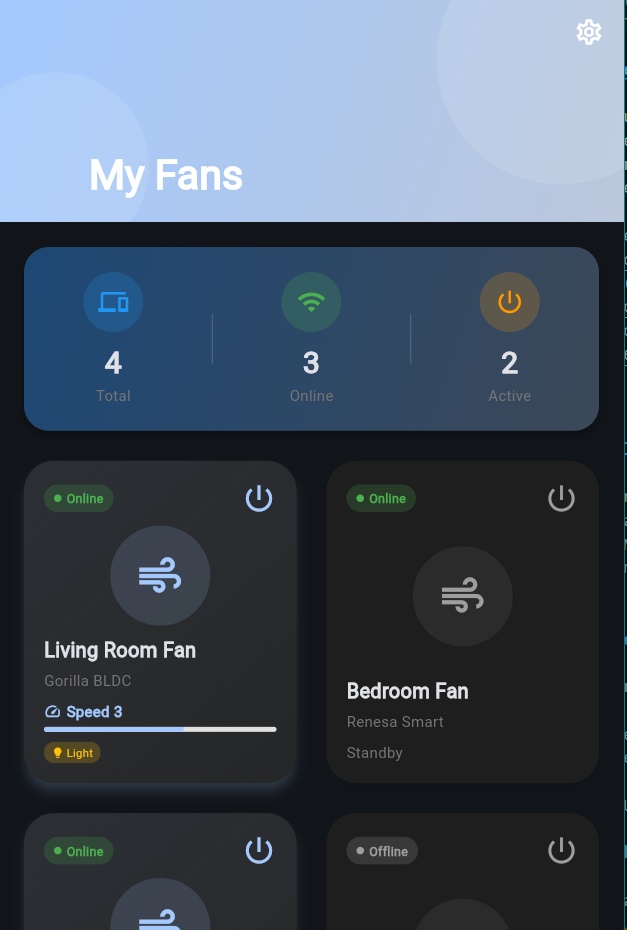

<div align="center">

# Atomberg Smart Fan Controller

Beautiful, responsive Flutter app ✨ for controlling Atomberg smart fans 🌀. Designed to impress at a glance 👀: smooth animations 🎞️, clean gradients 🌈, and an intuitive dashboard 📊. Ships with Mock Mode out of the box 🧪, and can connect to real APIs when needed 🔗.


</div>

## Highlights

- Elegant dashboard with animated fan cards and status chips
- One-tap controls: power, speed, breeze, and light
- Mock Mode ready by default — no backend required to demo
- Dark mode, Material 3 theming, subtle gradients and motion
- Clean architecture (domain/data/presentation) with Provider

## Screenshots




## Quick Start

1) Install dependencies

```bash
flutter pub get
```

2) Run (Mock Mode)

```bash
# Web
flutter run -d chrome

<p align="center">
	
	
	
	
	
</p>

<p align="center">
	<b>Control Atomberg smart fans with style — animated dashboards, smooth gradients, and one-tap actions. Mock Mode works out of the box; real API is a flip away.</b>
</p>

---

## 🚀 What is this project?

This is a production-quality Flutter app focused on:

* Beautiful, responsive UI that feels premium
* Practical controls: power, speed, breeze, light
* Real-world patterns: clean architecture, providers, services
* Works offline in Mock Mode; can switch to live APIs fast

---

## ✨ Key Features

✅ Animated device grid with status chips
✅ One-tap power, speed, breeze, and light controls
✅ Mock Mode (no backend required) for instant demos
✅ Material 3 theming, dark mode, tasteful gradients
✅ Clean architecture with domain/data/presentation layers

---

## 🧠 UI & Flow (Visual Overview)

```
Splash → Login → Device List (Grid) → Device Control (Actions)
```

Each screen is optimized for clarity, motion, and quick interaction.

---

## 🔄 Mock Mode → Real API (Step-by-Step)

Start in Mock Mode, then enable live data when ready:

```
device_list_screen.dart
	• initState(): uncomment provider fetch/startAutoRefresh
	• _onRefresh(): uncomment provider fetch

device_control_screen.dart
	• Uncomment provider control calls (power/speed/light/breeze)

api_constants.dart
	• Adjust base URL or headers if needed
```

---

## ⚙️ Tech Stack

<p align="left">
	
	
	
	
	
</p>

* Flutter + Dart (Material 3)
* Provider for state
* Dio for networking
* Shared Preferences for local storage
* Shimmer & custom animations for polish

---

## 📁 Project Structure

```
lib/
	core/         theme, constants, network utils
	domain/       entities, repos, usecases
	data/         services, repositories, models
	presentation/ screens, widgets, providers, animations
```

---

## ▶️ Quick Start

```bash
flutter pub get
```

Run in Mock Mode:

```bash
# Web
flutter run -d chrome

# Android/iOS
flutter run
```

Run tests (optional):

```bash
flutter test
```

---

## 🏗️ Why This Stands Out

✔️ Designed to impress quickly (animations, gradients, clean layout)
✔️ Real architecture, not throwaway code
✔️ Mock-first for instant demos; API-ready by design
✔️ Minimal friction to onboard and showcase

---

## 🧪 Future Enhancements

* Connect real fan images in `assets/images`
* Auto-refresh dashboard metrics with provider
* Device grouping, rooms, favorites
* Web build optimizations

---

## 🤝 Connect

Interested in:

* Flutter UI/UX ✨
* Clean architecture 🧩
* Building polished demos 🚀

Contributions and ideas are welcome — star the repo if you like the approach!
